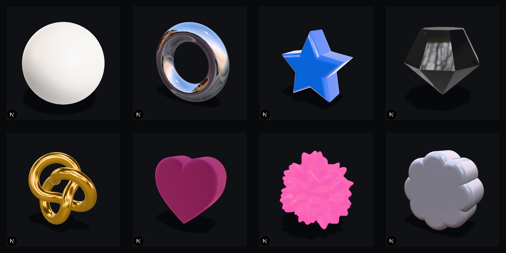
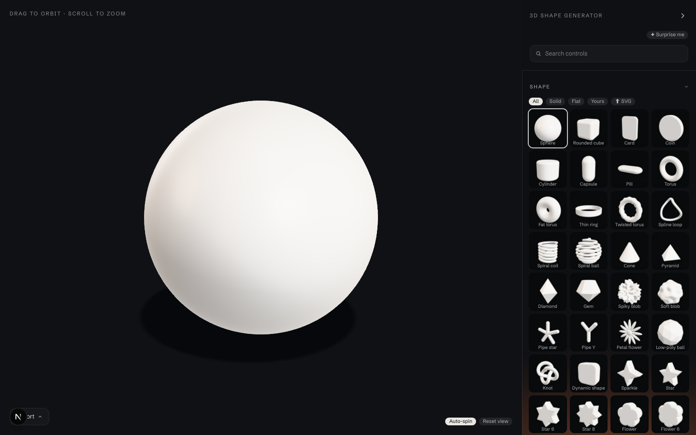

# 3D Shape Generator

Pick a shape, dress it — a material, a lighting room, a screen effect — and
take it away as a PNG, a web snippet, an English prompt or a 3D file. No signup,
and nothing to install in what you take away.



Fifty-eight shapes ship — twenty-five solids from sphere to torus knot, and
thirty-three flat outlines (stars, flowers, a heart, a gear, a moon) extruded
into solids — plus your own SVG, which lands with the same dials as every flat
shape. Fifty materials — plastics, metals, glass, neon, and textured ones like
leather, dragonscale, concrete, cracked glass and ice, whose bumps and grooves
are drawn in code so the copied snippet needs no image files — sixteen lighting rooms (eight real HDRIs from Poly
Haven, eight generated gradients), seven colour adjustments, and eight screen
effects in two stackable slots — a texture (pixelate, dither, halftone, ASCII,
outline) and a colour remap (duotone, posterize, threshold).



The shape has the whole window; drag to orbit it, scroll to zoom. The tools sit
in a drawer on the right that folds to a notch. Every preset in every section is
a position on the dials — pick Chrome and the roughness and metal sliders move
to where chrome lives, and stay live.

## Run it

```bash
pnpm install
pnpm dev
```

The eight Poly Haven lighting rooms ship prepared in `public/env/`, so that's
all you need to run it.

Other things you can run:

```bash
pnpm test           # the unit suite
pnpm test:visual    # committed screenshots: every shape, material, room and effect, the editor, the snippet
pnpm build:engine   # rebuild the embeddable bundle after changing src/engine/
pnpm shoot:thumbs   # reshoot the drawer's thumbnails from the engine (needs pnpm dev running)
pnpm fetch:env      # re-download the HDRIs into public/env/ (already committed)
```

## How it works

**One shape, one recipe.** Everything on screen is one flat object — the *spec*:
shape and its dials, material dials, room and light position, adjustments,
effect and its dials, backdrop, camera. Presets are fragments of it. There is no
per-shape or per-material code path anywhere past the catalogue.

**One engine, four outputs.** `src/engine/` is framework-free TypeScript that
depends only on `three`. The live preview, the copied snippet, the PNG and the
prompt are all produced from the same spec by the same `mount()`. The snippet
inlines the bundled engine, so what you see is what you copy by construction —
a test hashes the sources and fails if the bundle has gone stale.

**What you copy is one block.** A `div`, an import map pointing `three` at a
pinned CDN build, the engine, your settings as a short list of what you changed,
and one call. HDRI rooms load from this site (or from yours, if you copy the
file); gradient rooms need no files at all. A transparent backdrop works over
whatever page it lands on.

**The prompt** is the same spec as precise English with the real numbers, to
hand to Claude, Cursor or ChatGPT. **The GLB** is the mesh with its PBR material
for Blender, Spline or Figma — lighting and effects are ours, not the object's,
and do not travel.

**Surfaces are drawn, not downloaded.** A material's texture — leather grain,
scales, concrete, cracks, frost, hammered, brushed, weave, rock — is a tileable
height field computed by `src/engine/surfaces.ts` and turned into a normal map
and a roughness map at runtime. Any material can wear any surface, at any
scale and depth, from the Settings tab.

**Colours stay true.** The renderer uses Three's Neutral tone mapping (the
Khronos PBR Neutral curve, made for product shots), so a material's picked
colour is the colour you see, and the backdrop is fed the pre-image of its
colour through that curve so it comes out exact.

## Things to know

- Glass on a transparent backdrop refracts a neutral grey: there is nothing
  behind it to bend. Give it a solid or gradient backdrop for the real look.
- Pipe star and Pipe Y are overlapping tubes, not a true union. Solid materials
  hide the joins; glass shows them.
- An SVG upload needs filled shapes — outline any strokes first — and is refused
  past 20,000 points.
- Effects come in two slots, texture and colour, and run in that order:
  pixelate, dither, halftone, ASCII and outline restructure the picture, then
  duotone, posterize or threshold remaps its colours. One of each; two textures
  fight each other, so the panel does not offer them together.

## Credits

The real lighting rooms are CC0 HDRIs from [Poly Haven](https://polyhaven.com);
see [docs/CREDITS.md](docs/CREDITS.md) for which.

## Licence

MIT — see [LICENSE](LICENSE). The Poly Haven lighting rooms in `public/env/` are
CC0 and carry their own credit in [docs/CREDITS.md](docs/CREDITS.md).
